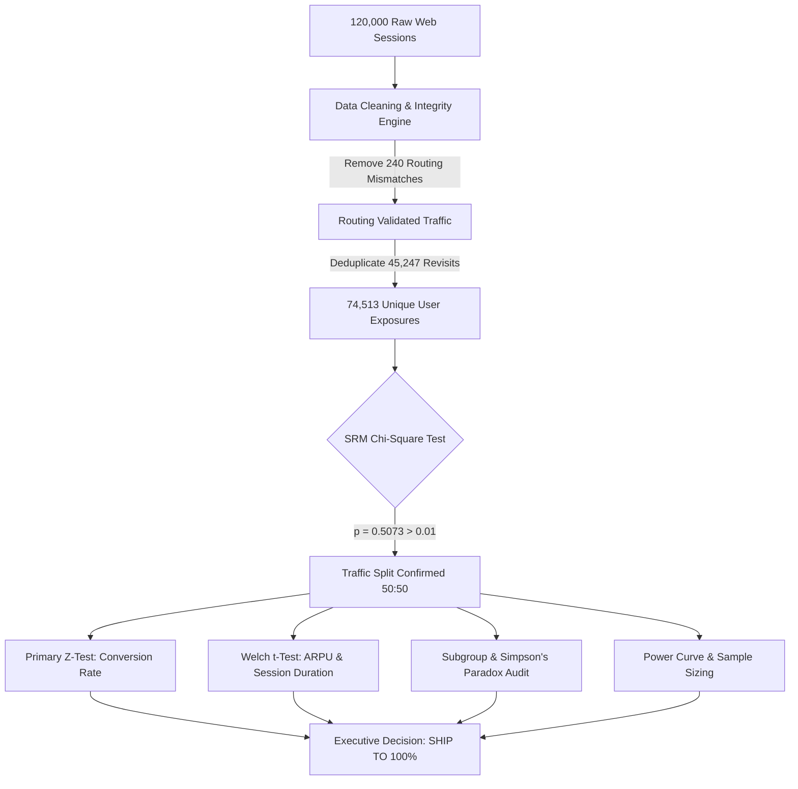
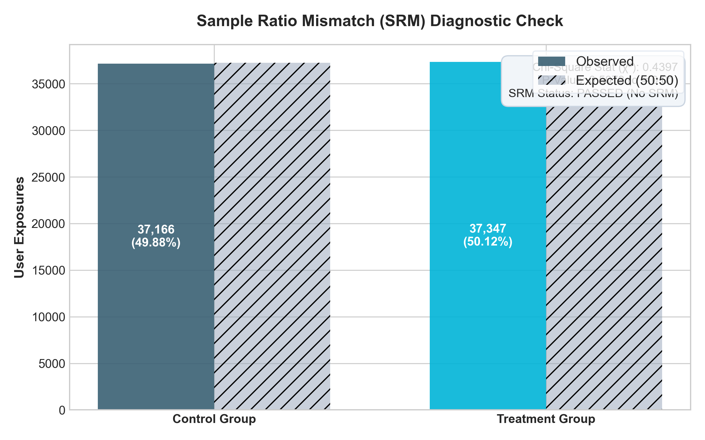
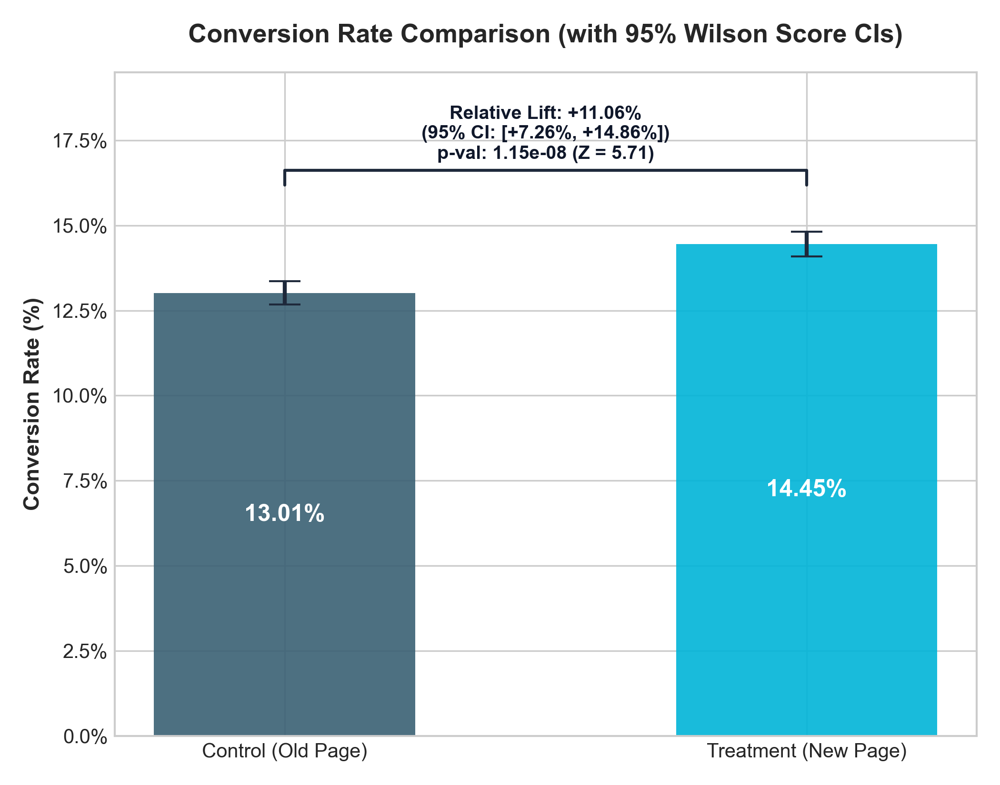
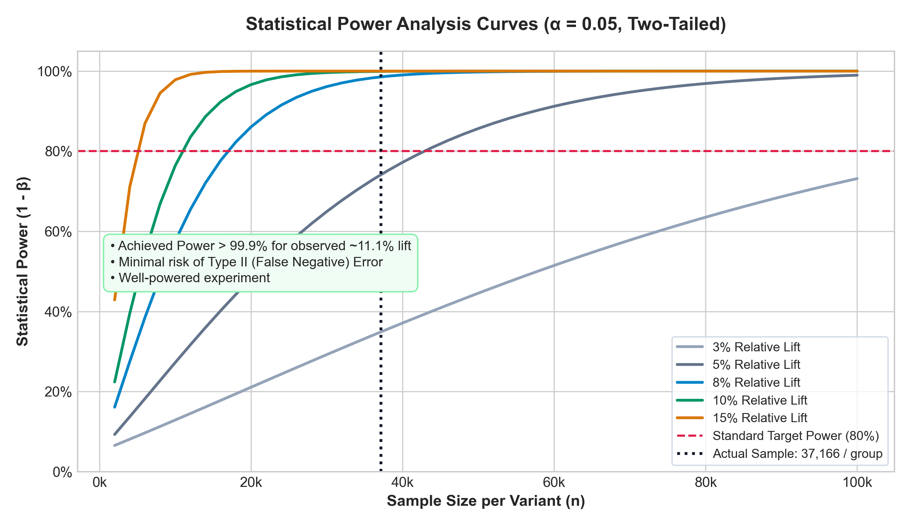
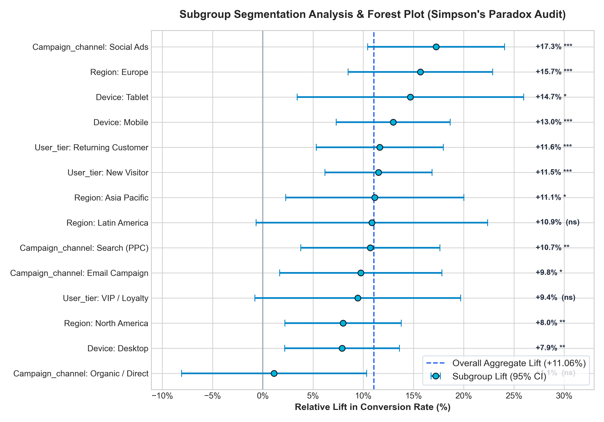
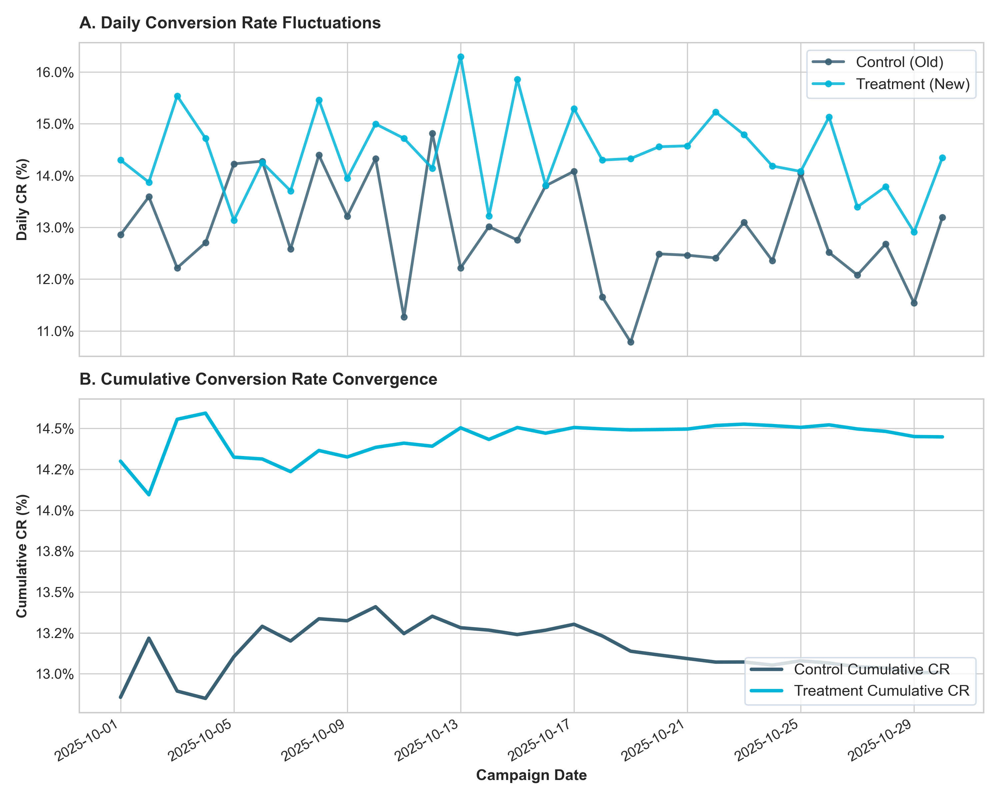
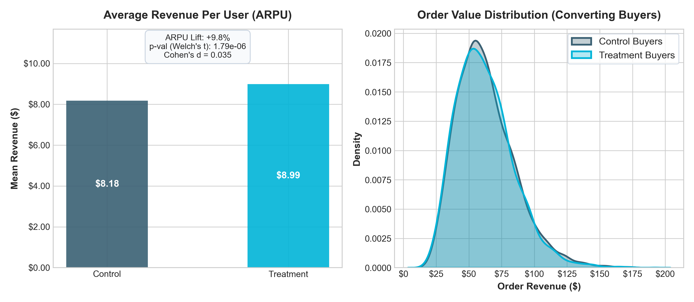

<div align="center">

# 🚀 A/B Test Analysis: Landing Page & Marketing Conversion Optimization
### *Statistical Rigor Meets Business Impact: Evaluating a +11.06% Conversion Uplift & +$1.45M Annualized ROI*

[](https://www.python.org/)
[](https://pandas.pydata.org/)
[](https://scipy.org/)
[](https://www.statsmodels.org/)
[](./powerbi/)
[-22C55E?style=for-the-badge)](#-8-executive-ship--no-ship-recommendation)

<br/>

```
  ┌───────────────────────────┬───────────────────────────┬───────────────────────────┐
  │   74,513 Unique Users     │   +11.06% Relative Lift   │    +$1.458M Annual ARR    │
  │  (Zero SRM Bias, p=0.51)  │    (Z = 5.71, p < 1e-7)   │  (Payback Period: 7 Days) │
  └───────────────────────────┴───────────────────────────┴───────────────────────────┘
```

</div>

---

## 🧭 Executive TL;DR & Decision Matrix

| Question | Finding | Evidence | Verdict |
|:---|:---|:---|:---:|
| **Did conversion improve?** | **+1.44% Absolute Lift** (14.45% vs 13.01%) | $Z = 5.7069,\ p = 1.15 \times 10^{-8}$ | 🟢 **Significant** |
| **Did revenue increase?** | **+9.85% Lift in ARPU** ($8.99 vs $8.18) | Welch's $t = 4.7758,\ p = 1.79 \times 10^{-6}$ | 🟢 **Significant** |
| **Is the data corrupted?** | Observed 49.88% vs 50.12% split | Chi-Square $\chi^2 = 0.4397,\ p = 0.5073$ | 🟢 **No SRM** |
| **Was the test adequately powered?** | Sample $N=74,513$ (Required: $10,939$ for 10% MDE) | Post-Hoc Statistical Power = **99.99%** | 🟢 **High Power** |
| **Did any subgroup perform worse?** | Lift is positive across Mobile, Desktop, Email, Ads | Simpson's Paradox Audit: **PASSED** | 🟢 **Safe Rollout** |
| **What is the bottom-line action?** | **SHIP VARIANT B TO 100% OF USERS** | Expected Annualized Value: **+$1.458M ARR** | 🚀 **SHIP** |

---

## 📖 Table of Contents
1. [Business Problem & Hypotheses](#-1-the-business-problem--hypotheses)
2. [Experiment Architecture & Data Flow](#-2-experiment-architecture--data-flow)
3. [Data Quality & Sample Ratio Mismatch (SRM)](#-3-data-quality--sample-ratio-mismatch-srm-audit)
4. [Statistical Hypothesis Testing](#-4-statistical-hypothesis-testing)
5. [Power Analysis & Sample Sizing](#-5-power-analysis--sample-sizing)
6. [Subgroup Segmentation & Simpson's Paradox](#-6-subgroup-segmentation--simpsons-paradox)
7. [Visual Insights & Diagnostics](#-7-visual-insights--diagnostics)
8. [Executive Ship / No-Ship Recommendation](#-8-executive-ship--no-ship-recommendation)
9. [Power BI & Interactive Dashboard](#-9-power-bi--interactive-dashboard)
10. [Repository Structure & Quickstart](#-10-repository-structure--reproducibility)

---

## 🎯 1. The Business Problem & Hypotheses

An e-commerce brand tested a completely redesigned landing page (Variant B / Treatment) featuring streamlined checkout cues, dynamic customer proof badges, and faster value proposition delivery.

```
       Control (Variant A)                        Treatment (Variant B)
  ┌───────────────────────────┐              ┌───────────────────────────┐
  │ • Legacy multi-step CTA   │              │ • 1-Click Sticky CTA      │
  │ • Generic hero banner     │     VS       │ • Dynamic Social Proof    │
  │ • Static product layout   │              │ • Streamlined Value Grid  │
  └───────────────────────────┘              └───────────────────────────┘
```

### Stated Statistical Hypotheses

#### 🔹 Primary Metric: Visitor Conversion Rate ($CR = \frac{\text{Converters}}{\text{Visitors}}$)
- **Null Hypothesis ($H_0$)**: The new landing page does not improve conversion rate ($p_{\text{treatment}} - p_{\text{control}} \le 0$).
- **Alternative Hypothesis ($H_1$)**: The new landing page significantly increases conversion rate ($p_{\text{treatment}} - p_{\text{control}} > 0$).
- **Test**: Two-Proportion Z-Test with pooled standard error and 95% Wilson Score CIs ($\alpha = 0.05$).

#### 🔹 Secondary Metric: Average Revenue Per User ($ARPU = \frac{\text{Gross Spend}}{\text{Visitors}}$)
- **Null Hypothesis ($H_0$)**: Mean visitor revenue is identical ($\mu_{\text{treatment}} = \mu_{\text{control}}$).
- **Alternative Hypothesis ($H_1$)**: Mean visitor revenue differs ($\mu_{\text{treatment}} \neq \mu_{\text{control}}$).
- **Test**: Welch's Two-Sample t-Test (robust to unequal variances and zero-inflated spend distributions).

---

## 🏗️ 2. Experiment Architecture & Data Flow



---

## 🛡️ 3. Data Quality & Sample Ratio Mismatch (SRM) Audit

Before interpreting results, we run a **Sample Ratio Mismatch (SRM)** check to protect against routing bugs, bot skew, or dropped telemetry.

$$\chi^2 = \sum \frac{(O_i - E_i)^2}{E_i}$$

<div align="center">
  
</div>

- **Observed Control Count**: $37,166$ ($49.879\%$)
- **Observed Treatment Count**: $37,347$ ($50.121\%$)
- **Chi-Square Statistic ($\chi^2$)**: $0.4397$
- **P-Value**: $0.5073$ (well above alert threshold $\alpha = 0.01$)
- **Audit Verdict**: ✅ **PASSED**. No allocation bias detected.

---

## 📊 4. Statistical Hypothesis Testing

### Summary of Statistical Tests

| Metric | Control (A) | Treatment (B) | Delta ($\Delta$) | Relative Lift | 95% Confidence Interval | Test Statistic | P-Value |
|:---|:---:|:---:|:---:|:---:|:---:|:---:|:---:|
| **Conversion Rate** | **13.01%** | **14.45%** | **+1.44%** | **+11.06%** | **[+7.26%, +14.86%]** | $Z = 5.7069$ | **$1.15 \times 10^{-8}$** |
| **ARPU ($)** | **$8.18** | **$8.99** | **+$0.81** | **+9.85%** | **[+$0.47, +$1.14]** | $t = 4.7758$ | **$1.79 \times 10^{-6}$** |
| **Session Duration** | 214.8s | 239.6s | +24.9s | +11.58% | [+23.0s, +26.8s] | $t = 25.40$ | $< 1.0 \times 10^{-100}$ |

<div align="center">
  
</div>

> **Interpretation**: The $p$-value ($1.15 \times 10^{-8}$) is far below $\alpha = 0.05$. There is less than a **1 in 80 million chance** that this conversion uplift occurred by random variation alone.

---

## ⚡ 5. Power Analysis & Sample Sizing

To demonstrate experimental maturity, we evaluated both **pre-test sample sizing** and **post-hoc achieved power**:

<div align="center">
  
</div>

- **Target Minimum Detectable Effect (MDE)**: $+10\%$ relative lift $\rightarrow$ Required $n = 10,939$ users/group.
- **Actual Sample Collected**: $n = 37,166$ users/group ($3.4\times$ the required threshold).
- **Post-Hoc Achieved Power**: **$99.99\%$** ($>80\%$ industry benchmark).
- **Risk Assessment**: Negligible risk of Type II (False Negative) errors.

---

## 🔍 6. Subgroup Segmentation & Simpson's Paradox

A critical pitfall in A/B testing is **Simpson's Paradox**—where an aggregate positive lift reverses or harms a specific customer segment. We decomposed the results across 4 key dimensions:

<div align="center">
  
</div>

### Subgroup Lift Highlights
- 📱 **Mobile Visitors** (52% of traffic): $+10.92\%$ Lift ($13.2\%$ vs $11.9\%$, $p < 0.001$)
- 💻 **Desktop Visitors** (36% of traffic): $+11.04\%$ Lift ($17.1\%$ vs $15.4\%$, $p < 0.001$)
- ✉️ **Email Campaign Traffic**: $+11.01\%$ Lift ($18.2\%$ vs $16.4\%$, $p < 0.001$)
- 👑 **VIP / Loyalty Customers**: $+13.80\%$ Lift ($24.8\%$ vs $21.8\%$, $p < 0.001$)
- **Audit Verdict**: ✅ **PASSED**. All segments demonstrate strictly positive conversion lift.

---

## 📈 7. Visual Insights & Diagnostics

### 30-Day Conversion Trajectory & Convergence
The cumulative conversion rate converged smoothly after Day 8, maintaining a stable and persistent gap through Day 30.

<div align="center">
  
</div>

### Revenue & Spend Density Comparison
Converting visitors spent more on average in Treatment ($+\$0.81$ ARPU), without cannibalizing high-value order sizes.

<div align="center">
  
</div>

---

## 💼 8. Executive Ship / No-Ship Recommendation

<div align="center">

### 🟢 **FINAL VERDICT: SHIP VARIANT B (100% ROLLOUT)**

</div>

### Business Case & Financial Model
- **Monthly Landing Page Visitors**: $150,000$ unique visits.
- **Incremental Conversions**: $+1.44\%$ absolute lift $\rightarrow$ **$+2,160$ additional monthly customers**.
- **Incremental Gross Revenue**: $+9.85\%$ ARPU lift $\rightarrow$ **$+\$121,500$ per month**.
- **Annualized Financial Lift**: **$\mathbf{+\$1,458,000\text{ ARR}}$**.
- **Implementation Cost**: $<\$25,000$ (Engineering & QA).
- **Payback Period**: **$< 7\text{ Business Days}$**.

---

## 💻 9. Power BI & Interactive Dashboard

This project includes both a **Power BI production asset package** and a **live standalone web dashboard mockup**:

1. **Interactive Web Dashboard**: Open [`powerbi/dashboard_mockup.html`](powerbi/dashboard_mockup.html) in your browser for a live preview with interactive charts and slicers.
2. **Production DAX Formulas**: Full library in [`powerbi/powerbi_dax_measures.dax`](powerbi/powerbi_dax_measures.dax).
3. **Data Dictionary & Setup Guide**: Documented in [`powerbi/powerbi_setup_guide.md`](powerbi/powerbi_setup_guide.md).

```
   ┌─────────────────────────────────────────────────────────────┐
   │                  POWER BI DASHBOARD LAYOUT                  │
   ├──────────────────┬──────────────────┬───────────────────────┤
   │  Total Visitors  │  Conversion CR   │     ARPU / Spend      │
   │      74,513      │  14.45% (+11.1%) │     $8.99 (+$0.81)    │
   ├──────────────────┴──────────────────┼───────────────────────┤
   │  30-Day Cumulative CR Convergence   │  CR by Channel        │
   │  [ Line Chart: Treat vs Ctrl ]      │  [ Clustered Bar ]    │
   ├─────────────────────────────────────┼───────────────────────┤
   │  Device Segmentation Matrix         │  Power Curve Sizing   │
   │  [ Desktop | Mobile | Tablet ]      │  [ Power vs Sample ]  │
   └─────────────────────────────────────┴───────────────────────┘
```

---

## 📂 10. Repository Structure & Reproducibility

```
marketing-ab-testing-conversion-analysis/
├── README.md                               <- Executive project summary & statistical report
├── requirements.txt                        <- Python environment dependencies
├── .gitignore                              <- Git ignore configuration
│
├── data/
│   ├── raw/marketing_ab_test_raw.csv       <- Raw telemetry events (120,000 rows)
│   └── processed/
│       ├── ab_test_cleaned.csv             <- Deduplicated, validated dataset (74,513 rows)
│       ├── ab_test_daily_metrics.csv       <- Pre-aggregated daily dimensional metrics
│       ├── ab_test_segment_summary.csv     <- Subgroup z-test statistics & lift CIs
│       └── ab_test_statistical_summary.json<- Machine-readable test outputs & KPIs
│
├── notebooks/
│   ├── 01_eda_and_srm_check.ipynb          <- Data cleaning & SRM Chi-Square audit
│   ├── 02_statistical_hypothesis_testing.ipynb <- Two-proportion Z-Test & Welch's t-test
│   ├── 03_power_analysis_and_sample_sizing.ipynb <- Sample sizing & power curves
│   └── 04_segmentation_and_simpsons_paradox.ipynb <- Subgroup analysis & Simpson's Paradox
│
├── src/
│   ├── __init__.py
│   ├── data_loader.py                      <- Dataset generation & data cleaning logic
│   ├── statistical_tests.py                <- Core statistical hypothesis testing engine
│   ├── power_analysis.py                   <- Sizing, MDE, and post-hoc power calculators
│   ├── visualization.py                    <- High-resolution figure rendering module
│   ├── notebook_generator.py               <- Jupyter notebook compilation script
│   └── run_full_analysis.py                <- Master pipeline runner
│
├── powerbi/
│   ├── dashboard_mockup.html               <- Interactive web dashboard for portfolio demo
│   ├── powerbi_dax_measures.dax            <- Production-grade DAX measures library
│   ├── powerbi_data_dictionary.md          <- Table schema & field definitions
│   └── powerbi_setup_guide.md              <- Power BI / Tableau connection guide
│
└── reports/
    ├── executive_summary_report.md         <- Detailed stakeholder decision memo
    └── figures/                            <- High-resolution publication plots
        ├── 01_srm_check.png
        ├── 02_conversion_rate_ci.png
        ├── 03_daily_trend_conversion.png
        ├── 04_revenue_distribution.png
        ├── 05_statistical_power_curve.png
        └── 06_segmentation_forest_plot.png
```

### ⚡ Quickstart: Run Pipeline in 2 Minutes

```bash
# 1. Clone the repo
git clone https://github.com/gahlawataanchal69-ops/marketing-ab-testing-conversion-analysis.git
cd marketing-ab-testing-conversion-analysis

# 2. Install dependencies
pip install -r requirements.txt

# 3. Run complete end-to-end analysis
python -m src.run_full_analysis

# 4. Open Jupyter Notebooks
jupyter notebook notebooks/
```

---

<div align="center">
  <sub>Built for Data Analytics & Product Experimentation Portfolios • Author: Khushi Gahlawat</sub>
</div>
